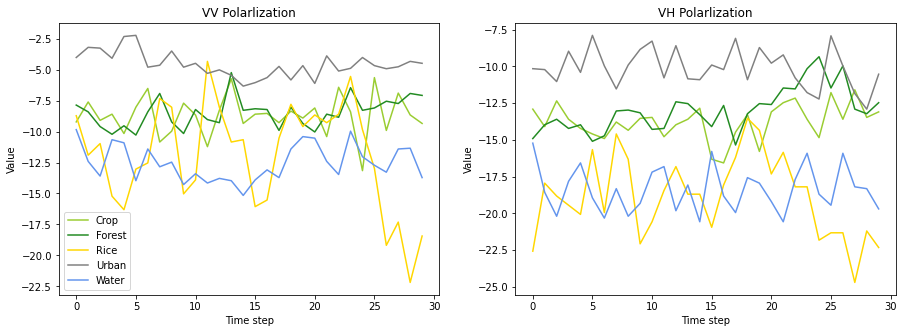

# Rice-Area-Classification
One-dimensional Convolutional Neural Network and Recurrent Neural Network to classify extracted Sentinel-1 pixel-based time-series. 
**1. Samples of time-seires** 
     
**2. One-dimensional Convolutional Neural Network**

|  | Weighted precision |  Weighted Recall | Weighted F1-score | Accuracy |
| :------: | :--------: | :--------: | :--------: | :--------: |
| VV | 0.86 | 0.857 | 0.854 | 0.857 |
| VH | 0.848 | 0.842 | 0.838 | 0.842 |
| Both | **0.848** | **0.842** | **0.838** | **0.842** |

**3. Recurrent Neural Network**

|  | Weighted precision |  Weighted Recall | Weighted F1-score | Accuracy |
| :------: | :--------: | :--------: | :--------: | :--------: |
| 1-layer |0.859 | 0.856 | 0.853 | 0.856 |
| 2-layer | **0.866** | **0.859** | **0.854** | **0.859** |
| 3-layer | 0.829 | 0.826 | 0.815 | 0.826 |  

Please read [report](RiceAreaReport_QuocKhanhTran.pdf) for more detail.
